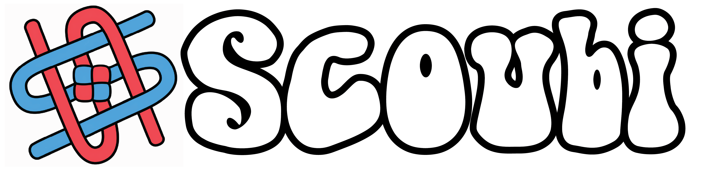

<p align="center">
  
</p>

# SCOUBI

SCOUBI is a computational framework for analyzing extrasomatic transcripts in imaging-based spatial transcriptomics data. Rather than discarding unassigned RNA as background, SCOUBI uses marker-gene expression of neurites and spatial ligand–receptor colocalization to classify extrasomatic regions as axon- or dendrite-enriched and to identify putative “interfaces” enriched for intercellular signaling programs. These interfaces provide a transcriptomic window into neuronal communication sites that are typically inaccessible to cell-centric spatial analyses. By preserving anatomical context, SCOUBI enables regional and molecular characterization of putative synaptic signaling environments directly from intact tissue.

**Preprint:** [add preprint link here](https://example.com/preprint)

## Overview

Imaging-based spatial transcriptomics often detects a substantial fraction of transcripts outside segmented cell bodies. SCOUBI treats this extrasomatic signal as a biologically informative layer of tissue organization.

The workflow has two main stages:

1. **Neurite identity classification**  
   Extrasomatic spatial bins are classified as axon- or dendrite-enriched using curated marker genes and a signaling-informed optimization objective.

2. **Interface identification**  
   SCOUBI scans for local regions where axonic and dendritic bins converge and where significant ligand–receptor pairs are colocalized.

The resulting interface map can be used to study:

- Spatial distribution of putative neuronal communication regions
- Neurite-enriched genes
- Interface-enriched genes
- Regional variation in interface transcriptomes
- Interface signatures compared with nearby cell bodies

## Installation

```bash
pip install scoubi
```

For local development from a checkout:

```bash
pip install -e .
```

## Quickstart

```python
import torch
import scoubi

device = torch.device("cuda" if torch.cuda.is_available() else "cpu")

adata = scoubi.io.load_data(
    "data/data.parquet",
    cell_type="data/cell_types.csv",
    region="data/regions.csv",
)

adata = scoubi.pp.bin_data(adata, binsize=2)
adata = scoubi.md.train(adata, axon_markers, dendrite_markers, device=device)
adata = scoubi.tl.overview(adata, device=device)
adata = scoubi.tl.axon_dendrite_enrichment(adata)
adata = scoubi.tl.distance(adata)
adata = scoubi.tl.expression_profile(adata, key="region")
adata = scoubi.tl.communication_profile(adata, key="region")

adata.summarize()
```

## Module Map

| Module | Alias | Purpose |
|---|---|---|
| `scoubi.io` | - | Data loading and AnnData helpers |
| `scoubi.preprocess` | `scoubi.pp` | Preprocessing (Spatial binning) |
| `scoubi.model` | `scoubi.md` | Neurite annotation |
| `scoubi.tools` | `scoubi.tl` | Downstream analysis utilities |
| `scoubi.plotting` | `scoubi.pl` | Visualization helpers |

## Data and Runtime Notes

- `scoubi.md.train()` can use a bundled ligand-receptor reference table (from NeuronChat) when `pairs=None`.
- GPU acceleration is optional; most workflows can run on CPU, although training and convolution-heavy steps are faster on CUDA when available.

## Tutorial

The guided walkthrough lives in [tutorial.ipynb](tutorial.ipynb). It covers data loading, model training, spatial overview generation, enrichment analysis, interface profiling, communication analysis, and save/load workflows.

## License

Released under the MIT License. See [LICENSE](LICENSE).

## Citation

> If you use SCOUBI in your work, please cite:
>
> ```bibtex
> @article{scoubi,
>   title = {SCOUBI: Signaling-informed Characterization of Unresolved Biological Interfaces},
>   author = {TODO},
>   journal = {TODO},
>   year = {TODO},
>   doi = {TODO}
> }
> ```
